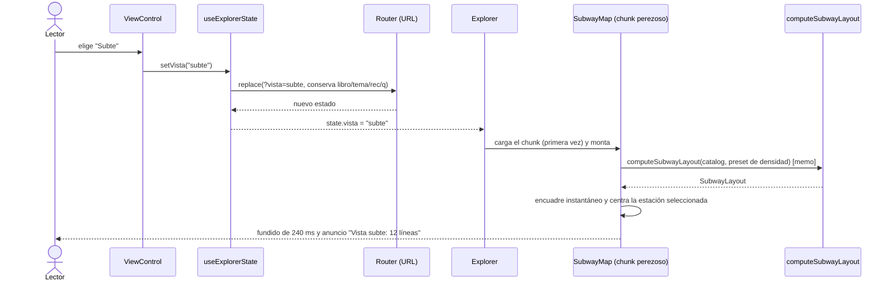
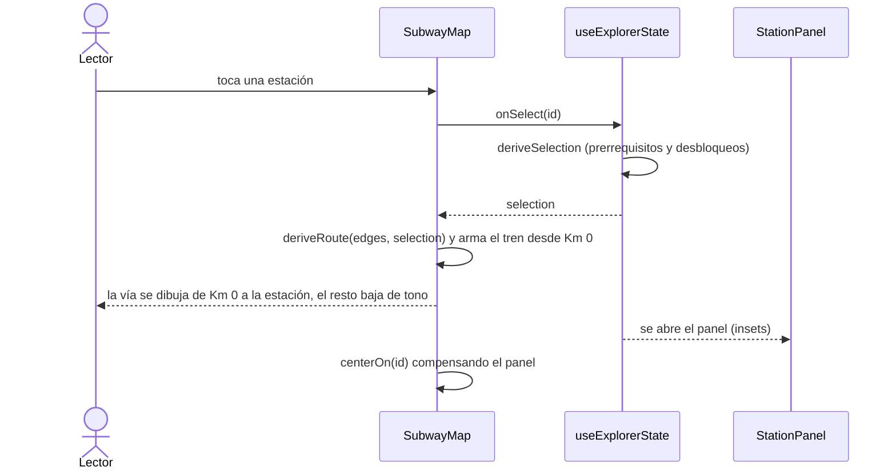

# Plan: Selector de vista (Grafo | Subte)

Rama `feat/vistas`, worktree `/Volumes/SSD/Work/dagerbooks-vistas`. Es un plan: no hay código de la app. Los tipos de las secciones 2 y 5 son el contrato acordado, no una implementación.

Nota de contexto: `PRODUCT.md` y el contrato `app-page-tsx.md` dicen 82 libros y 10 sectores. El catálogo real tiene **199 libros y 12 líneas (A–L)**. Se actualiza en la tarea C6.

---

## 0. Resumen ejecutivo

- Interpretación validada, con una corrección importante: **una línea de este catálogo no es un recorrido, es un bosque**. No se puede dibujar "un camino por línea con alguna bifurcación"; hay que dibujar un tronco, ramales y rieles de cabecera. Los números están en 1.1.
- Variante recomendada: **bandas horizontales por línea (A–L apiladas), niveles como zonas tarifarias en columnas alineadas entre líneas, Km 0 como estación larga vertical a la izquierda**, todo con segmentos a 0°, 45° y 90°. No se hace un esquema octilineal libre.
- Layout puro `computeSubwayLayout(catalog, config)`: asignación de carriles por "grilla de ocupación" voraz, con anchos de zona derivados de las bifurcaciones a 45°. Determinista, sin cruces dentro de una línea, con las pocas excepciones medidas por un script de invariantes.
- Se calcula **en el cliente, perezosamente**, dentro del chunk de la vista subte. El radial no paga ni un byte más.
- Estado: **`?vista=subte` en la URL** (default `grafo` se omite). No se usa localStorage.
- Render: **`SubwayMap.tsx` hermano** de `NetworkMap.tsx`. Se extraen primitivas compartidas (Station, tags de combinación, overlays, colisión, ruta, cámara) en un PR previo que no cambia ningún píxel del radial.
- Implementación: 3 agentes en paralelo, propiedad de archivos disjunta, 4 PRs apilados por seam.
- Principal tensión de diseño, para decidir con el usuario: la vista completa es **vertical** (~1.500 × ~3.500 px en compacta, estimación a verificar). Se resuelve con encuadre de ancho + foco por línea. Pregunta abierta 1.

---

## 1. Diseño de la vista Subte

### 1.1 Validación de la interpretación

Medido sobre `content/books.yaml` (199 libros, nivel 0 a 4):

| Dato | Valor | Consecuencia |
|---|---|---|
| Aristas `leadsTo` que no suben de nivel | **0** (ninguna es igual o decreciente) | `x` puede ser función monótona del nivel. Es la propiedad que hace viable todo el diseño. |
| Libros de nivel 1 | 85, de los cuales **50 no tienen hijos dentro de su línea** | Hay mucho nivel 1 "suelto" que solo cuelga de Km 0 por regla implícita. |
| Nivel 1 de Ficción / Desarrollo personal | 19 / 17 (17 y 12 sin hijos) | Una columna única de carriles sería de 19 filas. Hace falta subcolumnas. |
| Nivel 2 de Economía / Historia | 13 / 12 | Esas líneas necesitan ~13 carriles en su zona 2 sí o sí. |
| Aristas que saltan nivel (1→3, etc.) | 11 | Hay que dejar pasar el carril por una zona intermedia. |
| Libros con más de un padre en la línea | 13 | Aristas secundarias: hay que enrutarlas aparte. |
| `leadsTo` entre líneas distintas | 7 | No se dibujan como vía de banda; se tratan como conectores. |
| `related` | 20 pares | Estaciones de combinación. |
| Libros con más de un tema | 42 | En el foco por línea se incluyen (igual que `focus.ts`). |
| Libros de nivel 2+ sin padre dentro de su línea | 3 | Islas: sin vía de entrada, con chip de combinación. |

Conclusiones:

1. "Estaciones ordenadas por nivel a lo largo de la línea" funciona exactamente, porque el DAG es estrictamente creciente en nivel.
2. "Línea mayormente recta con bifurcaciones" funciona para los **35 libros de nivel 1 con hijos y sus descendientes**. Para los **50 de nivel 1 sin hijos** no hay recorrido que dibujar: son paradas de cabecera sin orden entre sí. Si se las encadena en una vía como "paradas en serie" se miente: se leería que A es prerrequisito de B. Esto obliga al concepto de **riel de cabecera** (ver 1.3).
3. Un esquema octilineal libre (tipo plano de Londres, optimizado globalmente) se descarta. Es un problema NP-difícil, no es determinista sin heurísticas pesadas, y rompe la semántica "zona = nivel" que ya enseña la vista radial.

Variantes evaluadas:

| Variante | Ganás | Pagás | Veredicto |
|---|---|---|---|
| **V1: bandas horizontales + zonas en columnas** | Niveles alineados entre las 12 líneas, comparar profundidad de un vistazo, labels horizontales a lo largo de la vía, algoritmo determinista y simple | Vertical y alto (~3.500 px) | **Recomendada** |
| V2: octilineal libre | Se parece a un plano real | Layout no determinista, sin zonas alineadas, semanas de tuning | Descartada |
| V3: solo una línea a la vez | Muy legible | No es "una vista" del mapa completo | Ya existe como **foco por línea** dentro de V1 |
| V4: dos caras, Km 0 al centro, líneas A–F a la derecha y G–L espejadas a la izquierda | Mitad de alto, más apaisado | Mitad de las líneas se leen de derecha a izquierda, labels espejados, encabezados de zona dobles | Diferida. Pregunta 1 |
| V5: bandas verticales (zonas como filas) | Apaisado | Los títulos son largos y horizontales: no corren a lo largo de la vía | Descartada |

### 1.2 Geometría

```
                   ZONA 1        ZONA 2         ZONA 3        ZONA 4      (encabezado, contraescalado)
                 : INTRO   :   INTERMEDIO   :   AVANZADO  :  ESPECIALISTA :
 [A] FUNDAMENTOS ▐█▌──●────:──────●─────────:────●────────:───●──── (A)
                 ▐█▌       :        ╲        :      ╱     :
 [B] MATEMÁTICAS ▐█▌──●────:───●─────●──╲    :   ●─╱      :
                 ▐█▌  ●    :           ●────:────●        :
 [C] SISTEMAS    ▐█▌──●────:──── ...
   ...
 Km 0 = píldora vertical de A a L. Cada banda sale de ella en horizontal.
```

- **Km 0**: estación larga vertical (píldora de 28 px) en `x = 0`, que abarca de la primera a la última banda. Es la convención de estación de combinación larga (Catedral / 9 de Julio, King's Cross). Usa el anillo doble porcelana de `rootOuter` / `rootInner` en forma de cápsula. Etiqueta "KM 0 · TOM SAWYER ABROAD" horizontal, arriba de la píldora.
- **Cabecera de línea a la izquierda de la píldora**: disco con letra + nombre en mayúsculas tracking, alineados a la derecha, a la altura del carril troncal. Es el patrón de rotulación de andén. Un segundo disco chico, clickeable, en el terminus derecho de la banda (lo que el radial hace con los discos al final del sector). Click en cualquiera = foco de línea (mismo `onTopic` que hoy).
- **Banda**: franja con tinte muy tenue alternado (no una caja). Altura = (carriles usados + filas de riel) × `lanePitch` + `bandGap`. Orden = orden de `topics.yaml` = letras A–L = cartelera.
- **Zonas = columnas** (decisión: columnas y no solo líneas verticales): separadas por verticales punteadas (el análogo de los anillos punteados del radial, mismo estilo `.zone`), con tinte alternado muy sutil, y el número de zona + nombre (`ZONE_NAMES`) en un encabezado. El encabezado es una **tira HTML fija arriba del escenario**, posicionada con `tf.x + colX * k`, `pointer-events: none`, para que siga visible al hacer pan vertical. Reemplaza al `ZoneNumeral` del meridiano radial.
- **Segmentos**: solo 0°, 45° y 90°. Los giros llevan un filete pequeño (`trackCorner`, mismo criterio que hoy).
- **Tinta y marcas**: iguales al radial (tinta de la línea, `RecMark` / `REC_DOT` para la forma de nivel de recomendación, marca "por completar" en la esquina, anillo de leído). Las estaciones de cualquier banda se dibujan con el mismo componente.

### 1.3 Niveles, troncos, ramas y rieles

Cada banda es un bosque con raíz en Km 0.

- **Tronco (carril 0, centro de la banda)**: el camino pesado del árbol cuyo origen es la estación de entrada ("Acá arrancás", la que ya marca `entry`). El hijo "pesado" de cada nodo es el que tiene mayor profundidad de descendientes, luego mayor tamaño de subárbol, luego `fuerte` antes que `mencion`, luego id. El tronco es recto de punta a punta siempre que se pueda.
- **Ramas**: un `leadsTo` que no sigue el camino pesado se **bifurca a 45°** en un carril contiguo y sigue **paralelo y horizontal**. Todas las diagonales de una misma bifurcación son paralelas y terminan a `forkMargin` antes de la columna destino; empiezan donde haga falta según cuántos carriles se desplacen. Así el abanico nunca se cruza a sí mismo y se ve como una bifurcación real.
- **Riel de cabecera** (los 50 libros de nivel 1 sin hijos y las islas): se ubican en filas (carriles externos) al borde de la banda, en una grilla de varias subcolumnas dentro de la zona 1, ordenados por nivel de recomendación (`fuerte` primero) y luego título. Cada fila sale de la píldora de Km 0 sobre un **riel tenue** (tinta de la línea al ~30 %, 2 px, sin punta) que es el `implicitRoot`. El riel pasa por detrás de las estaciones de esa fila. Es una convención: "estos libros arrancan en Km 0 y no tienen orden entre sí". Se explica en la leyenda. Para que no se lea como secuencia, el riel se dibuja tenue y no se anima; solo se enciende cuando la ruta seleccionada pasa por él.
- **Niveles**: la zona de una estación es su `level`. La coordenada `x` es función monótona del nivel. Toda arista `leadsTo` tiene `x_to > x_from` (invariante verificable).
- **Salto de nivel**: la vía atraviesa la zona intermedia reservando su carril en esa columna (la grilla de ocupación lo marca como ocupado).

### 1.4 Combinaciones (`related`) y conectores entre líneas

- Una combinación une dos estaciones de bandas distintas. Se dibuja como **conector octilineal**: diagonal a 45° hacia el hueco vertical más cercano entre columnas, recorrido vertical por ese hueco, diagonal a 45° de entrada. Doble trazo porcelana (`relatedOuter` / `relatedInner`), con halo del color del fondo donde cruza otras vías, para que lea como paso a distinto nivel.
- Visibilidad: como en el radial, **solo para la estación en hover o seleccionada** (se evita el enredo de 20 conectores verticales). Decisión deliberada, distinta del radial: las estaciones que tienen al menos una combinación muestran **un anillo porcelana tenue permanente** (≤ 40 estaciones), porque en un plano de subte la combinación es la información principal y no puede descubrirse solo con hover. El anillo pleno (el del radial) aparece en hover o selección.
- El tag "COMBINACIÓN + motivo" se reutiliza; su punto de anclaje es `edge.mid` (el layout lo informa, ver 2.2) en vez del punto medio de la curva cuadrática.
- Los 7 `leadsTo` entre líneas se tratan igual que `related` en visibilidad (aparecen en la ruta seleccionada, con el mismo enrutado vertical) pero con trazo de línea normal, no doble.
- **Foco por línea**: igual que hoy, las conexiones con otras líneas no se dibujan; se muestran como **discos de línea sobre la estación** (`links` de `focus.ts`, ya implementado). En subte los discos van arriba y abajo de la marca, no al costado, para no pisar la vía.

### 1.5 Foco por línea

- Mismo estado `?tema=` y mismo `onTopic`. La banda activa pasa a ocupar el escenario completo: se calcula un layout de **una sola banda** (con `computeSubwayFocusLayout`, que reutiliza el armado del subconjunto de `focus.ts`: libros con el tema en cualquier posición, más Km 0).
- Km 0 deja de ser una píldora larga y pasa a ser una estación circular (`rootOuter` / `rootInner`) de tamaño normal.
- En foco hay más aire: `lanePitch` × 1,25 y títulos en dos renglones (`topicActive` en el pase de labels).
- Escape: primero cierra la estación, después sale del foco (igual que hoy).
- Transición entre mapa completo y foco: se reutiliza el modelo existente (capas de vías con fade, estaciones con `transform` CSS que se deslizan, `data-morph`). Las bandas son la geometría; las estaciones de otras líneas se desvanecen en el lugar.

### 1.6 Densidad

- Los 3 presets (`compacta` / `media` / `aireada`) reutilizan `DENSITY_SCALE` para las marcas, y agregan `SUBWAY_DENSITY_PRESETS` para el espaciado (propuesta inicial, a ajustar con capturas):

| | `lanePitch` | `colPitch` (subcolumna del riel) | `zoneGapMin` | `bandGap` |
|---|---|---|---|---|
| compacta | 34 | 120 | 150 | 28 |
| media | 44 | 160 | 190 | 40 |
| aireada | 56 | 210 | 240 | 56 |

- Semántica idéntica a la actual: aireada = más aire entre estaciones y marcas más chicas, el detalle aparece con zoom.

### 1.7 Filtro `rec`, leído, por completar

Todo esto es tono y atributos de la estación, no geometría; se hereda sin tocar lógica:

- `rec`: `dimmed` baja las estaciones y vías a `data-tone="dim"` (un tercio de tinta), igual que hoy.
- "Leído": `data-read` con el mismo estilo (anillo / relleno).
- "Por completar": la muesca en la esquina de la estación.
- La forma por nivel de recomendación (`REC_DOT`) se mantiene.

### 1.8 Selección: ruta de prerrequisitos y desbloqueos

- Misma `deriveSelection` (`lib/state/explorer.ts`); el estado no cambia.
- La cadena de prerrequisitos se **dibuja desde Km 0 como un tren que corre** (stroke draw, ease-out-expo, instantáneo con reduced motion): mismos `pathLength={1}` y variables `--i` / `--n`. Funciona igual con polilíneas.
- Los desbloqueos van en tono medio; el resto, tenue.
- Cálculo de la ruta: se extrae de `NetworkMap` a una función pura compartida (`lib/map/route.ts`, tarea B1). Hoy vive dentro de un `useMemo` del componente y no depende de la geometría, solo de `edges`, `selection` y la raíz.
- Si la ruta incluye un riel de cabecera, el riel se enciende solo en el tramo de esa estación.

### 1.9 Labels

- **Horizontales siempre. Nunca rotados.**
- **Una línea por defecto**, truncada a ~26 caracteres, altura 13 px. Cabe entre dos carriles (paso mínimo 34 px) apoyado sobre su propia vía. Dos renglones y título completo para: estación seleccionada, hover, y todas las del foco por línea.
- **Cuatro posiciones candidatas** por estación, todas horizontales: `ne` (arriba a la derecha, por defecto), `se`, `nw`, `sw`. El layout sugiere una (`labelSlot`): si la estación bifurca hacia arriba, `se`; si bifurca hacia abajo, `ne`; si bifurca a ambos lados o no bifurca, `ne`. El pase de colisión puede probar las demás.
- **Colisión**: se mantiene el pase voraz por prioridad (seleccionada, hover, cadena de prerrequisitos, desbloqueos, entradas, resto) y los umbrales por nivel y por zoom (`labelMul`, `entryAt`, `LABEL_MIN_REL`). Se agrega un obstáculo nuevo: **los segmentos de vía** (el layout los entrega en `edge.pts`). Una caja contra un segmento octilineal es una prueba barata.
- Para no tocar la colisión radial, la lógica nueva vive en `components/map/subway/labels.ts` y reutiliza las primitivas extraídas (`Box`, `boxesOverlap`, `aabb`, `wrapTitle`, `truncate`) y la tabla de prioridades.
- En la vista completa a zoom de encuadre solo se ven discos, nombres de línea, encabezados de zona y las estaciones de entrada: igual que el radial a ese zoom.

### 1.10 Mobile (390 px)

- El selector se reduce a **dos botones solo con ícono**, de 44 px de lado como mínimo (objetivo táctil), junto al control de densidad. Hay que verificarlo con captura: no puede tapar Km 0, la primera banda ni la barra de foco (que hoy cuelga justo debajo de densidad).
- Vista completa en 390 px: **encuadre al ancho de la zona 1 y 2**, alineado arriba a la izquierda sobre Km 0 y la banda A. La red completa (~1.500 px de ancho) a 390 px daría una escala de ~0,25, con labels ilegibles. El botón "Ver toda la red" (reset) lleva al encuadre de red completa.
- Flujo principal en mobile: tocar un disco de línea (o la cartelera) entra en foco; en foco el encuadre inicial es un **zoom de lectura** (`k ≥ 0,85`) anclado a la cabecera, y el resto se recorre con pan horizontal. La tira de zonas HTML da la orientación.
- Panel de estación: el bottom sheet actual (`insets.bottom = 360`) no cambia; `centerOn` ya lo compensa.
- Teclado: no aplica en táctil; el mapa sigue siendo `role="button"` por estación.

---

## 2. Algoritmo de layout

### 2.1 Ubicación y firma

```ts
// lib/catalog/subway.ts   (Agente A)
export function computeSubwayLayout(
  catalog: LayoutCatalog,                  // el mismo tipo que usa computeLayout
  partial?: Partial<SubwayLayoutConfig>,
): SubwayLayout;

// lib/catalog/subway-focus.ts   (Agente A)
export function computeSubwayFocusLayout(
  books: readonly FocusBook[],
  related: readonly FocusRelated[],
  topicId: string,
  config?: Partial<SubwayLayoutConfig>,
): SubwayFocusLayout;                      // { topicId, layout: SubwayLayout, count, links }
```

Puras, sin Node ni Zod ni React; corren igual en servidor y cliente. Redondeo a `precision` decimales, `-0` evitado, igual que `computeLayout`.

### 2.2 Tipos: qué se generaliza y qué no

Respuesta corta: **no se generaliza `Layout`.** El `Layout` actual es polar por construcción (`angle`, `r`, `sectors`, `rings`, `outerRadius`). Volverlo opcional rompe a todos sus consumidores y sirve de poco.

- `lib/catalog/layout.types.ts`: cambio **aditivo** en `LayoutEdge`: `mid?: { x: number; y: number }` y `pts?: readonly [number, number][]`. El radial no los llena y no cambia nada. `LayoutBounds` y `LayoutEdge` ya son compartidos.
- Tipos nuevos en `lib/catalog/subway.types.ts`:

```ts
export interface SubwayLayoutConfig {
  lanePitch: number;      // distancia vertical entre carriles
  colPitch: number;       // distancia entre subcolumnas del riel de cabecera
  zoneGapMin: number;     // mínimo horizontal entre columnas de zona
  forkMargin: number;     // tramo recto entre el fin de la diagonal y la estación
  bandGap: number;
  pillWidth: number;
  headerWidth: number;    // ancho a la izquierda de la píldora (disco + nombre)
  zoneHeaderHeight: number;
  maxRailRows: number;    // filas de riel de cabecera por lado
  nodeRadius: number;
  trackCorner: number;
  precision: number;
}

export interface SubwayNode {
  id: string;
  x: number; y: number;
  level: number;               // 0-4
  sector: string | null;       // línea primaria; null en Km 0
  band: number;                // índice de banda (-1 en Km 0)
  lane: number;                // relativo al carril troncal (0)
  sub: number;                 // subcolumna dentro de la zona (0 salvo riel)
  role: "root" | "spine" | "branch" | "rail" | "island";
  labelSlot: "ne" | "se" | "nw" | "sw";
  rank: number;                // orden global por y, para el teclado
}

export interface SubwayBand {
  topicId: string; index: number;
  y0: number; y1: number;      // extensión vertical
  spineY: number;
  startX: number; endX: number;
  entryId: string | null;
  count: number;
}

export interface SubwayZone {
  level: number;               // 1-4
  x: number;                   // columna principal de estaciones
  x0: number; x1: number;      // extensión incluidas subcolumnas y hueco de entrada
}

export interface SubwayLayout {
  nodes: SubwayNode[];                       // orden del catálogo
  edges: LayoutEdge[];                       // con pts y mid; kind: leadsTo | implicitRoot | related
  bands: SubwayBand[];
  zones: SubwayZone[];
  pill: { x: number; y0: number; y1: number; width: number };
  bounds: LayoutBounds;
  minNodeDistance: number;
  crossings: { tree: number; secondary: number }; // cruces vía-contra-vía (métrica)
  config: SubwayLayoutConfig;
}
```

- **El render** (`components/map/subway/types.ts`, Agente A) no inventa un segundo contrato: `SubwayMapNode = MapNode & { band; lane; sub; role; labelSlot; rank }` con `angle = 0` y `r = x`, así `Station` se reutiliza sin cambios (`deg(node.angle)` da 0, y la marca de entrada, un tick vertical, queda perpendicular a una vía horizontal, que es lo correcto). `SubwayGeometry = { nodes: SubwayMapNode[]; edges: LayoutEdge[]; bands; zones; pill; bounds }`.
- `MapGeometry` (radial) **no se toca**. No hay unión discriminada: dos geometrías, dos componentes. Menos riesgo para el radial.

### 2.3 Algoritmo (por banda, luego global)

Entrada: libros de la banda (los de `primaryTopic === t`; en foco, el subconjunto de `focus.ts`).

1. **Bosque de la banda.**
   - Aristas explícitas `leadsTo` con origen y destino dentro de la banda.
   - Padre primario de `v` = el origen en la banda con mayor nivel; empate por mayor tamaño de subárbol; luego id. Los otros orígenes son **aristas secundarias** (13 en el catálogo).
   - Los de nivel 1 cuelgan de Km 0 (arista implícita o explícita).
   - Clasificación: nivel 1 con hijos en la banda = **raíz de árbol**; nivel 1 sin hijos = **riel**; nivel 2 o más sin padre en la banda = **isla**.
2. **Peso.** Para cada nodo: profundidad máxima y tamaño del subárbol. Hijo pesado = (profundidad, tamaño, `recommendation`, id).
3. **Raíz del tronco.** La raíz de árbol marcada `entry` (si hay varias, la de mayor profundidad; si ninguna, la de mayor profundidad). Su camino pesado va en el **carril 0**.
4. **Grilla de ocupación.** Celdas `(carril, ranura)`. La ranura `2z` es la columna de la zona `z`; la ranura `2z-1` es el hueco de entrada de la zona `z`. Cada estación ocupa una celda de columna. Cada tramo horizontal ocupa las celdas de columna y hueco que recorre. Cada diagonal ocupa **todos los carriles entre origen y destino** en el hueco de entrada de la zona destino.
5. **Colocación voraz por prioridad**: primero el tronco, luego el resto de los árboles por peso descendente, y dentro de cada árbol, por nivel. Cada rama nueva busca el carril más cercano al del padre probando `d = 0, +1, -1, +2, -2, …` y se queda con el primero para el que **la celda de la estación y el recorrido horizontal posterior de toda la rama estén libres, y los carriles intermedios estén libres en el hueco**. Eso garantiza cero cruces de vías dentro de un árbol por construcción. Si ningún carril dentro de `maxLanes` sirve, se coloca en el menos malo y se incrementa `crossings.tree` (métrica y no un error silencioso).
6. **Aristas secundarias**: se enrutan después, con el mismo criterio (horizontal por el carril del origen, diagonal justo antes de la columna destino). Si el carril está ocupado se acepta el cruce con halo y se cuenta en `crossings.secondary`.
7. **Riel de cabecera**: se reparten alternando arriba y abajo en filas **fuera** de la extensión de carriles del árbol. Cada fila sale de la píldora. Filas = `ceil(rieles / subcolumnas)`, con las subcolumnas que hagan falta (hasta `maxRailRows` filas por lado, el resto va a subcolumnas dentro de la zona 1). Orden dentro de la fila: `fuerte`, `interesante`, `mencion`, y luego título. Optimización posible (v1.1, no en v1): rellenar huecos de carriles libres dentro de la extensión del árbol.
8. **Altura de la banda** = (extensión total de carriles + filas de riel + 1) × `lanePitch`. Se apilan las bandas en orden de letras, con `bandGap`.
9. **Anchos de zona, global.** Para cada zona `n`: `gapIn[n] = max(zoneGapMin, maxΔcarril entrante a la zona n, en cualquier banda × lanePitch + 2 × forkMargin)`; ancho de subcolumnas = `max(subcolumnas del riel en cualquier banda)`. Esto asegura que **toda diagonal a 45° entre**: el desplazamiento horizontal disponible es siempre mayor o igual que el vertical. Las columnas de todas las bandas quedan **alineadas**, que es el punto de que "zona" signifique algo.
10. **Aristas a polilínea.** `pts` con segmentos 0/45/90 y `path` con filetes. `mid` = punto medio del recorrido (para el tag de combinación).
11. **Conectores** (`related` y `leadsTo` entre líneas): diagonal a 45° saliendo de la estación hacia el hueco vertical más cercano, tramo vertical por ese hueco, diagonal a 45° de entrada. El hueco se elige entre los de los extremos para minimizar el largo. `bridge: true` en el halo.
12. **`labelSlot`** según las direcciones de bifurcación de la estación (ver 1.9). **`rank`** = orden global por `y` y luego `x`.
13. **Bounds**: `minX = -(headerWidth + pillWidth/2 + pad)`; `maxX = x1 de la última zona + disco del terminus + pad`; `minY = -zoneHeaderHeight`; `maxY = fondo de la última banda + pad`. Se verifica con el script de invariantes que contienen a todo.

Complejidad: ≤ 30 estaciones por banda, ≤ 14 carriles; todo es lineal o cuadrático sobre números chicos. Se espera ≪ 30 ms para las 199 estaciones, y el script lo mide.

### 2.4 Servidor o cliente

**Cliente, perezoso.**

- El radial se precalcula en el servidor para 3 densidades y se serializa en `page.tsx`. Hacer lo mismo con el subte enviaría 3 layouts más a todos los visitantes, incluidos los que nunca abren la vista subte.
- La función necesita solo lo que `geometrySet` y `explorerNodes` ya llevan al cliente (id, nivel, tema primario, `leadsTo`, `related` con motivo, `entry`, `recommendation`). Es el mismo camino que ya usa el foco, que calcula en el cliente.
- `SubwayMap` se importa con `next/dynamic`; el layout viaja en ese chunk. El bundle del radial no crece.
- Determinismo: sin `Math.random` ni orden de `Map` no estable. La misma entrada da la misma salida (verificado por el script, dos corridas con igual JSON). No hay riesgo de hidratación porque el mapa no se renderiza en el servidor (la página usa `Suspense` + `useSearchParams`).
- Si en el futuro se quisiera SSR o una imagen OG de la vista subte, la función ya es pura y se puede llamar en build.

---

## 3. Selector de vista

### 3.1 Dónde y cómo se ve

- **Escritorio**: arriba a la derecha, en el **mismo cartel que la densidad**. Un solo contenedor con borde de 2 px (`--rule-strong`, `--bg-sunken`, `--shadow-panel`) y dos secciones apiladas: "Vista" (arriba) y "Densidad" (abajo). No se agrega una segunda tarjeta flotante. Se corre a la izquierda cuando el panel de estación está abierto, igual que hoy (`.stage[data-panel="open"] .density`).
- Control: segmentado de dos opciones con el estilo exacto de `DensityControl` (rotulado, hairlines, activo en `--fg` sobre `--fg-on-ink`), con glifos de 20 px: **Grafo** (círculo con tres radios) y **Subte** (línea horizontal con una bifurcación a 45°). Texto "Grafo" y "Subte" en `--font-sign`, mayúsculas, `--tracking-label`.
- La nota al pie (`hint`) del cartel cambia según la vista (en subte: "Cada línea es una banda. Las zonas son los niveles.").
- Mobile: ver 1.10.

### 3.2 Estado: URL, no localStorage

Recomendación: **`?vista=subte`** en la URL. `grafo` es el valor por defecto y **se omite** (los links existentes siguen igual).

| | URL (`?vista=`) | localStorage |
|---|---|---|
| Compartir un link | Funciona: `/?vista=subte&tema=economia&libro=...` abre lo mismo en otro navegador | El receptor ve la vista que el emisor no eligió |
| Back / forward | Sí (con `replace` no ensucia el historial) | No |
| SEO | Sin efecto. La página prerenderiza el mismo HTML (el mapa es cliente) y el canonical se fija en `/` | Sin efecto |
| Coherencia | Es el mismo mecanismo que `libro`, `tema`, `rec`, `q` | Es una preferencia personal, como densidad |
| Costo | Cero | Hook nuevo, estado dual |

La densidad sí va en localStorage porque es una **preferencia de pantalla**. La vista cambia **qué contenido muestra el link**, por eso va en la URL. No se persiste además en localStorage (dos fuentes de verdad, y un link compartido tendría que ganarle siempre). Cambiar de vista usa `replace`.

- `lib/view.ts` (nuevo): `VISTAS = ["grafo", "subte"] as const`, `Vista`, `DEFAULT_VISTA`, `isVista`, `VISTA_LABEL`.
- `lib/state/explorer.ts`: `ExplorerState.vista`, `parseExplorerState` (valor inválido cae a `grafo`), `buildExplorerSearch` (omite el default). Todo lo demás (selección, `dimmed`, `reconcileFocus`) no cambia.
- `hooks/useExplorerState.ts`: `setVista(v)` con `replace`.
- `app/page.tsx`: `metadata.alternates.canonical = "/"` para que ninguna variante `?vista=` compita en el índice. Los libros siguen accesibles como HTML plano en `/estaciones` y `/libros/[slug]`.

### 3.3 Transición

- Cambiar de vista = **fundido cruzado corto** (240 ms, ease-out-expo, la entrante hace fade-in sobre el escenario) más reencuadre instantáneo de la cámara. Con `prefers-reduced-motion`, cambio instantáneo.
- **No** se intenta deslizar las estaciones de polar a bandas: 199 estaciones recorriendo cientos de píxeles en trayectorias que se cruzan se ve ruidoso, y obligaría a un único componente con las dos geometrías. Queda como mejora opcional (las estaciones ya tienen `key` estable).
- La selección (`?libro`) y el foco (`?tema`) se conservan al cambiar de vista; al montar, la nueva vista centra la estación seleccionada (mecanismo `bootCentered`). La ruta de prerrequisitos se anima de nuevo.
- La región `role="status"` anuncia: "Vista subte: 12 líneas" / "Vista grafo".

### 3.4 Accesibilidad

- `role="radiogroup"` con nombre accesible "Vista del mapa", dos `role="radio"` con `aria-checked`, roving tabindex, flechas y Home / End (idéntico a `DensityControl`). No es una navegación sino un modo de presentación, por eso no es `tablist`.
- Foco visible con el mismo `outline` de 2 px de `--focus`. Objetivos ≥ 44 px en mobile.
- Subte: cada estación sigue siendo `role="button"` con `aria-label` (título, línea, zona, estado). La ayuda `#map-help` cambia: "Flechas arriba y abajo: estaciones de la misma zona. Derecha e izquierda: zona siguiente o anterior."
- Teclado: se agrega una opción `axis: "radial" | "horizontal"` a `useGraphKeyboard` que remapea las teclas (derecha = hacia afuera, izquierda = hacia el centro, arriba / abajo = vecino en la zona). `NavNode` se llena con `ring = level` y `angle = rank` normalizado, así el resto del hook (vecinos, preferencia de ángulo, wrap) funciona sin cambios.
- Todo libro sigue alcanzable como HTML plano (`/estaciones`, nav `sr-only`): sin cambios.
- `prefers-reduced-motion`: sin tren animado, sin fundido.

---

## 4. Reutilización

Enfoque elegido: **`SubwayMap.tsx` hermano** más extracción previa de lo realmente compartido. No un render único parametrizado por geometría.

Por qué no un componente único: `NetworkMap` tiene 1.223 líneas y está atravesado por supuestos polares (`Ground` con sectores y anillos, discos en `outer + 66`, `placeLabels` con cajas rotadas, nombres bajo los discos, `polar()` en la colocación). Parametrizar todo eso es una refactorización grande con riesgo alto sobre la vista que el usuario ya quiere, para un resultado que sigue necesitando ramas `if (vista)` en todas partes.

| Se reutiliza (extraído, sin cambio de comportamiento) | Se queda en `NetworkMap` | Es nuevo en `SubwayMap` |
|---|---|---|
| `usePanZoom` (tal cual) | `Ground` (sectores, anillos, divisores) | Píldora de Km 0, bandas, columnas de zona, tira de zonas |
| `useGraphKeyboard` (+ opción `axis`) | Discos terminus polares y nombres | Cabecera de línea (disco + nombre) y terminus derecho |
| Cámara: pan/zoom, handle imperativo, centrado inicial → `useMapView` | `placeLabels` radial (cajas rotadas) | `placeSubwayLabels` (4 slots + obstáculos de vía) |
| `Station` (con `cross`, `interchange`, `read`, tono) | Reencuadre por densidad y foco | Conectores octilineales y halo |
| `InterchangeTags` + `XTag` (anclaje por `edge.mid`) | | Riel de cabecera |
| Cálculo de ruta y desbloqueos → `lib/map/route.ts` | | Encuadre inicial en mobile |
| FocusBar, HoverTag, leyenda (`MapOverlays`) | | |
| Primitivas: `Box`, `boxesOverlap`, `aabb`, `truncate`, `wrapTitle`, `wrapName`, `clamp` → `shared/geometry.ts` | | |
| Clases CSS de estación, punto, muesca, tick, tag y leyenda: `SubwayMap` importa `NetworkMap.module.css` | | `SubwayMap.module.css` (zona, banda, píldora, riel) |

Garantía de no ruptura del radial: la tarea B1 es una **extracción pura**. Criterio: capturas del radial antes y después (1440 y 390, compacta / media / aireada, con libro seleccionado y con línea en foco) con diferencia de píxeles igual a cero. Sin esa verificación el PR no se mergea.

`Explorer` elige el componente:
```
vista === "subte" ? <SubwayMap lazy/> : <NetworkMap/>
```
Las dos exponen el mismo handle (`MapHandle`: `zoomIn`, `zoomOut`, `reset`, `centerOn`), así `MapControls`, `StationBoard`, `StationPanel` y los `insets` no cambian.

---

## 5. Plan de implementación: 3 agentes en paralelo

### 5.1 Contrato congelado antes de empezar

Se acuerdan tal cual y se versionan en el primer commit de A (T0, ~1 h):

1. **Tipos** de la sección 2.2 (`lib/catalog/subway.types.ts`, `components/map/subway/types.ts`).
2. **Props de `SubwayMap`**, calcadas de `NetworkMapProps` salvo la geometría (el cálculo ocurre adentro, en el chunk perezoso):

```ts
export interface SubwayMapProps {
  set: MapGeometrySet;                 // metadatos + aristas (de ahí salen los related)
  explorerNodes: readonly ExplorerNode[];
  lines: readonly MapLine[];
  density: Density;
  activeTopic: string | null;          // foco de línea
  selection: Selection | null;
  recLabels: Record<Recommendation, { label: string; description: string }>;
  dimmed: ReadonlySet<string>;
  read: ReadonlySet<string>;
  onSelect(id: string | null): void;
  onTopic(id: string | null): void;
  insets?: { right?: number; bottom?: number };
  animateRefit?: boolean;
  ref?: Ref<MapHandle>;
}
export type MapHandle = { zoomIn(): void; zoomOut(): void; reset(): void; centerOn(id: string, minK?: number): void };
```
`NetworkMapHandle` pasa a ser un alias de `MapHandle`.

3. Exports: `components/map/SubwayMap.tsx` exporta **`SubwayMap`** nombrado. Explorer lo carga con `dynamic(() => import("./SubwayMap").then(m => m.SubwayMap))`.
4. `lib/view.ts` y `ExplorerState.vista` los define C; A y B no los necesitan.

### 5.2 Propiedad de archivos (sin superposición)

**Agente A: layout y datos** (puro, sin React)
- Crea: `lib/catalog/subway.types.ts`, `lib/catalog/subway.ts`, `lib/catalog/subway-focus.ts`, `components/map/subway/types.ts`, `components/map/subway/resolve.ts` (adaptador `MapGeometrySet` + `ExplorerNode[]` + densidad + foco → `SubwayGeometry`), `scripts/check-subway-layout.ts`.
- Edita: `lib/catalog/layout.types.ts` (solo `mid?` y `pts?` en `LayoutEdge`), `lib/catalog/focus.ts` (extrae `buildFocusSubset` compartido; el comportamiento del radial es idéntico), `package.json` (solo el script `check:subway`).
- No toca nada de `components/` salvo los dos archivos bajo `components/map/subway/` que crea.

**Agente B: render**
- Crea: `components/map/shared/geometry.ts`, `components/map/shared/Station.tsx`, `components/map/shared/InterchangeTags.tsx`, `components/map/shared/MapOverlays.tsx`, `lib/map/route.ts`, `hooks/useMapView.ts`, `components/map/SubwayMap.tsx`, `components/map/SubwayMap.module.css`, `components/map/subway/labels.ts`.
- Edita: `components/map/NetworkMap.tsx` (solo imports y uso de lo extraído), `components/map/NetworkMap.module.css` (solo si hace falta exportar una clase), `components/map/types.ts` (agrega `MapHandle`), `hooks/useGraphKeyboard.ts` (opción `axis`, por defecto el comportamiento actual).

**Agente C: estado, selector, integración, documentación**
- Crea: `lib/view.ts`, `components/explorer/ViewControl.tsx`, `components/explorer/ViewControl.module.css`.
- Edita: `lib/state/explorer.ts`, `hooks/useExplorerState.ts`, `components/explorer/DensityControl.tsx` y `.module.css` (variante embebida en el cartel compartido), `components/map/Explorer.tsx`, `components/map/Explorer.module.css`, `app/page.tsx` (solo `metadata.alternates.canonical`), `PRODUCT.md`, `.impeccable/surfaces/app-page-tsx.md` (adenda de la vista subte, texto en 5.5).
- Responsable de la verificación final (capturas y CDP).

Ningún archivo aparece en dos agentes. Si B o C necesitan un cambio en un archivo ajeno, lo piden al dueño.

### 5.3 Tareas y orden

**Ola 1 (en paralelo, sin dependencias)**

| Id | Agente | Tarea |
|---|---|---|
| A0 | A | T0: tipos y contrato (commit chico, primero) |
| A1 | A | `computeSubwayLayout` + `scripts/check-subway-layout.ts` (invariantes de 6.2). Entregable M1: layout real mergeado en la rama |
| B1 | B | **Extracción pura** de lo compartido (sección 4) y verificación de cero píxeles en el radial |
| C1 | C | `lib/view.ts`, estado `vista` en URL + hook, `ViewControl` (con tests manuales de teclado), cartel compartido con `DensityControl`, `Explorer` con `vista` y un `SubwayMap` provisional |

**Ola 2 (depende de M1 de A y de B1)**

| Id | Agente | Tarea | Depende de |
|---|---|---|---|
| A2 | A | `computeSubwayFocusLayout`, `labelSlot`, `resolve.ts`, ajuste de presets de densidad con capturas | A1 |
| B2 | B | `SubwayMap`: bandas, píldora, zonas, vías, estaciones, selección y tren, `placeSubwayLabels`, teclado `axis`, cámara y encuadre mobile | B1, A1, contrato |
| C2 | C | Integración real: `dynamic` del chunk, fundido, `insets`, anuncios a lectores de pantalla, tira de zonas HTML, mobile del selector | B2 (stub hasta entonces) |

**Ola 3 (verificación y pulido)**

| Id | Agente | Tarea |
|---|---|---|
| C3 | C | Capturas 1440 y 390, CDP, typecheck, lint, build; lista de hallazgos por dueño |
| A3 / B3 | A / B | Arreglos de hallazgos propios |
| C4 | C | Adenda de contrato, `PRODUCT.md` (82 → 199 libros, 10 → 12 líneas, vista subte), revisión final de acabado |

Ruta crítica: **A1 → B2 → C3**. Lo más riesgoso es A1 (la asignación de carriles). Debe empezar el día uno y B2 arranca con un layout provisional (v0: una fila por banda) para no esperarlo.

### 5.4 PRs apilados (un seam por PR, verde en cada commit)

1. **`refactor/mapa-primitivas-compartidas`** (B1): extracción pura, radial idéntico.
2. **`feat/layout-subte`** (A0, A1, A2): layout, script de invariantes, foco. Sin cambios de UI.
3. **`feat/selector-de-vista`** (C1): estado en URL y selector. Con `vista=subte` aún muestra el radial hasta que llegue el PR 4 (o detrás de un `SubwayMap` mínimo).
4. **`feat/vista-subte`** (B2, C2, C3, C4): `SubwayMap` e integración.

Cada PR pasa `pnpm typecheck && pnpm lint && pnpm build` por separado.

### 5.5 Adenda propuesta para `.impeccable/surfaces/app-page-tsx.md` (la escribe C4)

> **Vistas.** El selector de vista (Grafo | Subte) comparte cartel con la densidad. La vista Subte conserva la identidad: esmalte de medianoche, estaciones porcelana, 12 tintas con disco de letra, zonas punteadas, combinaciones como anillos pareados, Big Shoulders y Overpass. Geometría: bandas horizontales por línea desde Km 0 (píldora larga a la izquierda), niveles como zonas en columnas, ramas a 45°, labels siempre horizontales. La línea elegida arde y el resto baja a un tercio de su tinta. Estado en `?vista=`.

---

## 6. Riesgos, criterios de aceptación y preguntas

### 6.1 Riesgos

| Riesgo | Prob. | Impacto | Mitigación |
|---|---|---|---|
| Vista completa muy vertical (~1.500 × ~3.500 px en compacta; estimación a verificar con el script) y ilegible en el encuadre total | Alta | Alto | Encuadre al ancho, foco por línea como lectura principal, relleno de huecos del riel (v1.1), pregunta 1 |
| La asignación voraz de carriles deja cruces entre aristas secundarias | Media | Medio | Se mide (`crossings`), el halo los hace legibles como paso a distinto nivel, tope aceptado en 6.2 |
| Los rieles de cabecera se leen como secuencia o prerrequisito | Media | Alto (principio 2 del producto) | Riel tenue, sin animación, leyenda explícita, solo se enciende en la ruta |
| Regresión visual en el radial por la extracción | Media | Alto | B1 con diferencia de píxeles cero como condición de merge |
| Labels horizontales chocando con diagonales | Alta | Medio | 4 posiciones candidatas más segmentos de vía como obstáculos |
| `.impeccable/tmp/` está en `.gitignore` y no existe en este worktree: `shot.mjs` e `interact.mjs` no están disponibles | Cierta | Bajo | Antes de C3, copiarlos (copia, no mover) desde el worktree principal con autorización del usuario, o recrearlos |
| Dos componentes de mapa duplican lógica de cámara | Media | Bajo | `useMapView` compartido |
| Peso del chunk perezoso | Baja | Bajo | Se verifica en el build que el chunk del radial no cambia de tamaño |

### 6.2 Criterios de aceptación (verificables)

**Layout (`pnpm tsx scripts/check-subway-layout.ts`, para las 3 densidades y para el foco de las 12 líneas)**
1. Determinismo: dos corridas dan JSON idéntico.
2. Todo segmento de `pts` tiene pendiente 0, 1, -1 o vertical (tolerancia 1e-6).
3. Toda arista `leadsTo` cumple `x_to > x_from`; todo nodo de nivel `n` está en la columna de la zona `n`.
4. Ningún par de estaciones a menos de `2 × nodeRadius + 8` px.
5. `crossings.tree === 0`; `crossings.secondary` impreso y con tope documentado (se fija con el primer resultado real, no se adivina).
6. Las bandas no se solapan; `bounds` contiene todo; las columnas de zona tienen el mismo `x` en todas las bandas.
7. Tiempo de cómputo de las 199 estaciones: impreso; objetivo < 30 ms por layout.
8. Las islas, rieles y raíces suman las 199 − 1 estaciones: ninguna se pierde.

**Visual (capturas a 1440 × 900 y a 390 × 844, con `.impeccable/tmp/shot.mjs`)**
9. Vista subte completa, compacta y aireada, a 1440 y 390.
10. Foco de Economía (la banda más ancha) y de Ficción (la de más riel), a 1440 y 390.
11. Libro seleccionado con ruta de prerrequisitos y desbloqueos, con panel abierto (a 1440 el panel no tapa la estación; a 390 el bottom sheet tampoco).
12. Filtro `rec` en solo "fuerte", con estaciones atenuadas.
13. Estaciones leídas y "por completar" visibles.
14. Una combinación en hover con su tag.
15. Selector de vista: sin solapar Km 0, la primera banda ni la barra de foco a 390; objetivos ≥ 44 px.
16. Radial: capturas idénticas píxel a píxel antes y después del PR 1.

**Interacción (smoke CDP con `.impeccable/tmp/interact.mjs`)**
17. Click en "Subte": URL pasa a `?vista=subte`, el mapa subte aparece; click en "Grafo": la URL pierde `vista`.
18. Cargar `/?vista=subte&tema=economia&libro=<id>` directo: foco, selección y panel abiertos, la estación centrada.
19. Atrás / adelante del navegador conserva la vista.
20. Teclado: flechas entre estaciones (derecha = zona siguiente), Enter abre, Escape cierra, Escape otra vez sale del foco.
21. Pan, zoom y botones de `MapControls` funcionan en subte.
22. Sin errores en consola; reduced motion deja todo instantáneo.

**Calidad**
23. `pnpm typecheck`, `pnpm lint` y `pnpm build` (incluye `validate`) pasan en cada PR. El chunk del radial no crece.

### 6.3 Flujos





### 6.4 Preguntas abiertas (solo las que cambian el diseño)

1. **Forma de la red completa.** La vista Subte completa es vertical (~3.500 px de alto en compacta) y se lee de a una línea, con foco. Alternativa: dos caras (Km 0 en el centro, líneas A–F a la derecha y G–L espejadas a la izquierda), que reduce el alto a la mitad pero hace que la mitad de las líneas se lea de derecha a izquierda. Recomiendo la vertical con encuadre al ancho. ¿Aceptás eso o preferís las dos caras?
2. **Vista por defecto.** Recomiendo que siga siendo **Grafo** (es la identidad aprobada y la primera pantalla del contrato). ¿Confirmás, o querés que Subte sea la primera para quienes llegan sin parámetros?
